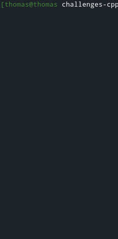

# Tetris for Linux
This projects is my attemt at programming the classic Tetris game with c++ for the linux terminal. 

## Demo


## Installation
Clone this repository and build the app using the following command:<br>
```make```<br>
Next, run the application as such:<br>
```./bin/tetris-cli```

## How to play
### Controls
* `q`: to move piece to the left
* `d`: to move piece to the right
* `s`: to move piece down one row
* `a`: to rotate piece anticlockwise
* `e`: to rotate piece clockwise
* `spacebar`: drops piece to the floor at once

### Score
Every time you clear a line you get rewarded points. If you manage to clear multiple lines at once, you'll get a bonus.

* `1-line`: 50 points
* `2-lines`: 125 points
* `3-lines`: 200 points
* `4-lines`: 275 points

## Code structure
|Class      |Description|
|:---------:|-----------|
|Game       | This class contains the game loop which is mainly responsible for updating the game after a fixed interval|
|Arena      | This is the game field where every piece gets stored in a 2D-array |
|Collisions | Determines if the next position of a piece is valid. If needed it also locks a piece into place|
|Colors     | This class is responsible for displaying every piece in its unique color |
|keyRegister| Contains methods to register a key-press and to translate them into a movement|
|Piece      | Contains a multidimensional-array with all possible pieces and rotations |
|Score      | Keeps track of the score and provides methods to increase the score according to the number of rows that got cleared|
|Scoreboard | Displays the current score and the next piece above the arena |
|GameOver   | This class is called when the user loses. The class presents the user with their score and makes it possible for the user to retry or quit|